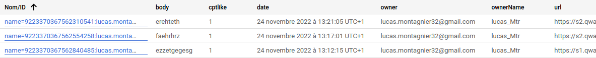
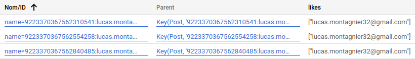
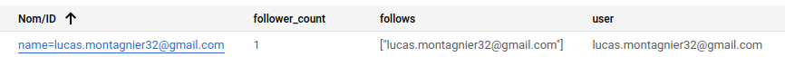
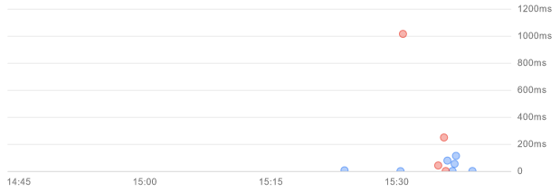

# TinyGram

Nathan DESHAYES, Malo LE RESTE, Lucas MONTAGNIER

Projet de Web and Cloud de Master 1

## Screen des kinds du datastore:

#### Kind Post:

#### Kind Likes:

#### Kind Follows:

## Benchmark:

#### Mesure de quelques requêtes:

##### Capture d'écran du temps de réponse en millisecondes de plusieurs requêtes sur le deploy du tinygram:

